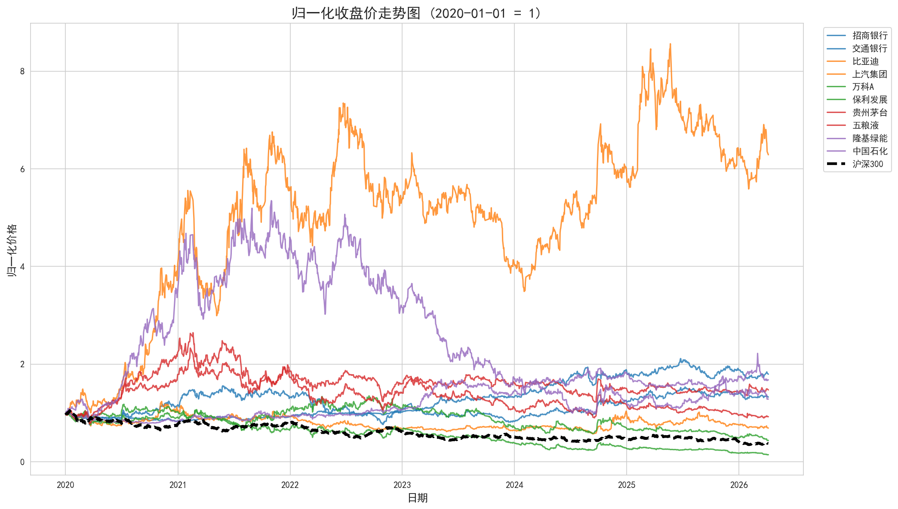
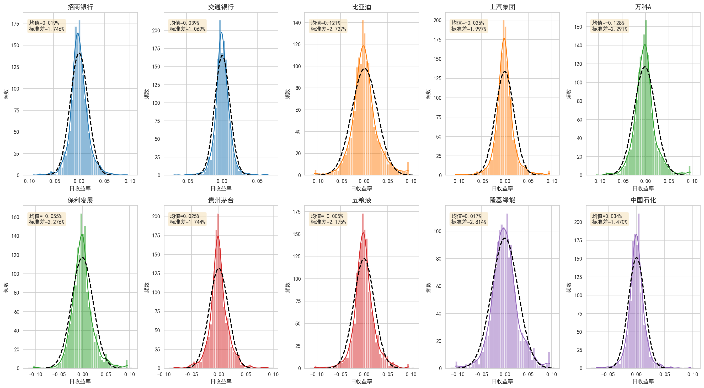
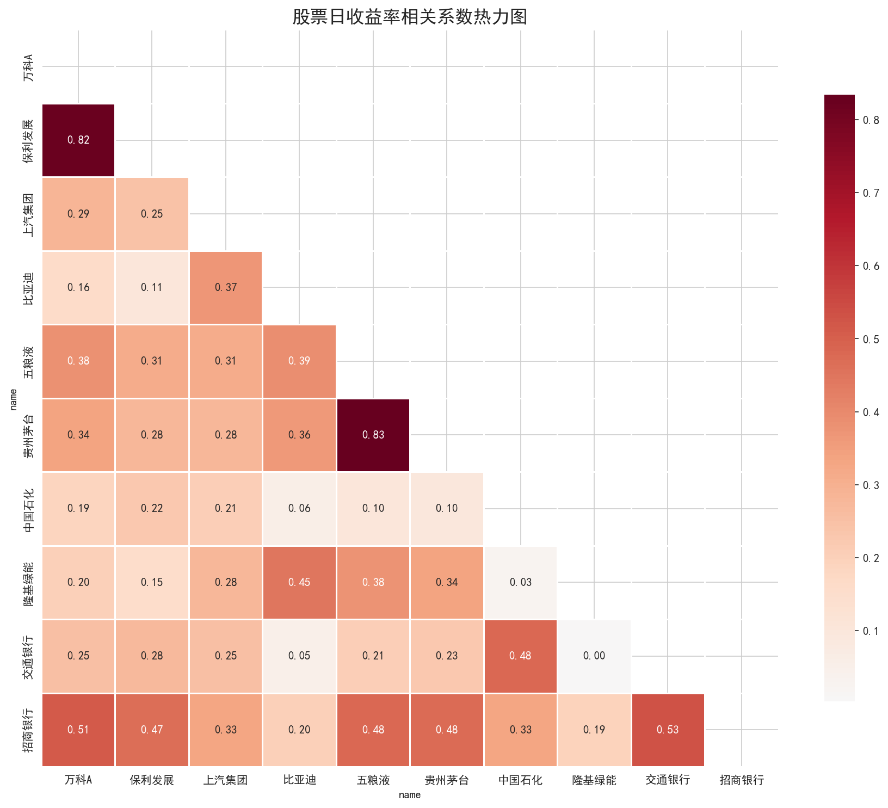
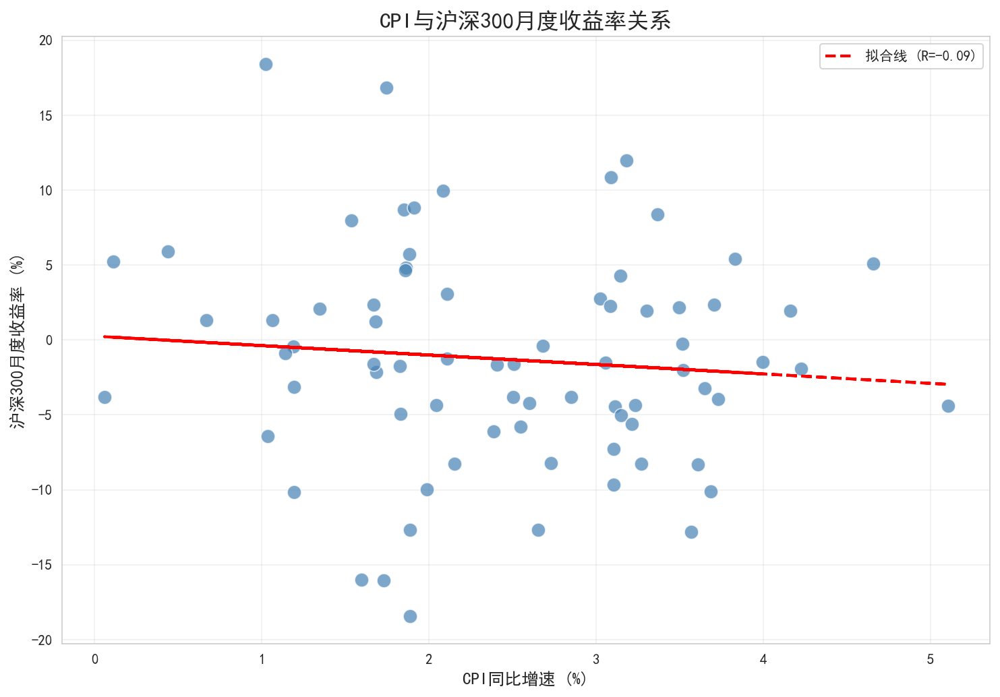
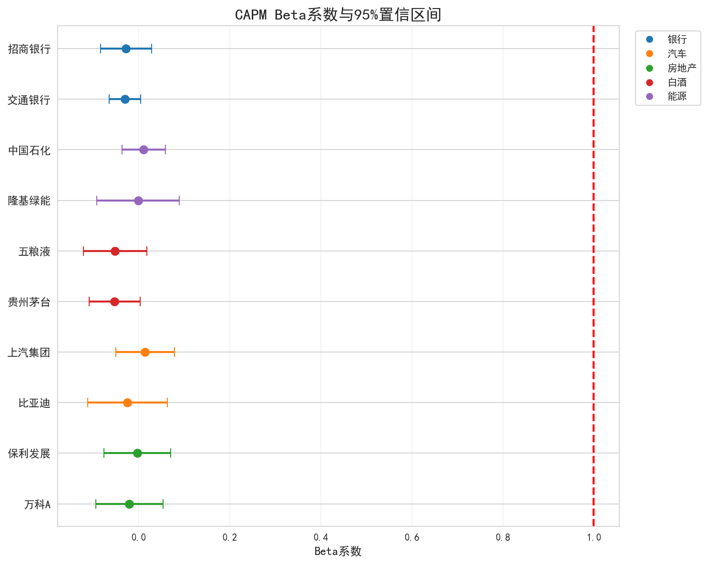

# 统计分析

## 描述性统计

计算了10只股票日收益率的描述性统计量：

| 股票 | 行业 | 年化均值 | 年化波动率 | 偏度 | 峰度 | 最大回撤 |
|------|------|---------|----------|------|------|---------|
| 招商银行 | 银行 | 0.0468 | 0.2773 | 0.2649 | 3.1522 | -0.5094 |
| 交通银行 | 银行 | 0.0972 | 0.1698 | -0.0188 | 5.7285 | -0.1952 |
| 比亚迪 | 汽车 | 0.3060 | 0.4330 | 0.3044 | 2.0912 | -0.5254 |
| 上汽集团 | 汽车 | -0.0618 | 0.3171 | 0.3385 | 5.2774 | -0.5399 |
| 万科A | 房地产 | -0.3234 | 0.3638 | 0.6562 | 3.2720 | -0.8657 |
| 保利发展 | 房地产 | -0.1380 | 0.3614 | 0.5617 | 3.2238 | -0.6765 |
| 贵州茅台 | 白酒 | 0.0642 | 0.2770 | 0.2629 | 3.6141 | -0.4748 |
| 五粮液 | 白酒 | -0.0136 | 0.3454 | 0.0880 | 3.3162 | -0.6609 |
| 隆基绿能 | 能源 | 0.0416 | 0.4469 | 0.2153 | 1.6554 | -0.8169 |
| 中国石化 | 能源 | 0.0860 | 0.2335 | 0.3550 | 5.3676 | -0.2506 |

**主要观察**：

- **行业分化明显**：新能源汽车（比亚迪）年化收益最高，房地产行业（万科A、保利发展）表现最差
- **波动率差异**：新能源股票（隆基绿能、比亚迪）波动率较高，银行股（交通银行）波动率最低
- **收益率分布**：大部分股票呈现正偏态，峰度均大于正态分布（峰度=3），显示尖峰厚尾特征
- **最大回撤**：房地产和新能源股票回撤较大，银行和传统能源股相对抗跌

## 可视化分析

### 图1：归一化收盘价走势图

展示了10只股票和沪深300指数从2020年初至今的归一化价格走势。白酒和新能源行业股票在部分时段表现出较高的涨幅，而房地产行业股票呈现持续下行趋势。银行和传统能源行业股票表现相对平稳。

### 图2：日收益率分布图

10只股票的日收益率分布呈现明显的尖峰厚尾特征，比正态分布有更多的极端值。不同行业的波动率差异较大，银行股（交通银行）的分布更为集中，而新能源股（隆基绿能、比亚迪）的分布更为分散。

### 图3：收益率相关系数热力图

同行业内的股票相关性普遍较高：

- 两只银行股（招商银行、交通银行）相关系数约0.25
- 两只白酒股（贵州茅台、五粮液）相关系数约0.31
- 两只房地产股（万科A、保利发展）相关系数约0.29

不同行业间的相关性相对较低，验证了行业分散化投资的好处。整体来看，所有股票之间都存在一定的正相关，反映了系统性风险的影响。

### 图4：宏观指标与股市关系

展示了CPI同比增速与沪深300月度收益率的关系。样本期内Pearson相关系数为-0.09，统计上不显著（p值=0.43）。通胀对股市的影响是复杂的，需要结合具体的经济周期阶段来分析。

## CAPM模型估计

对10只股票分别估计了CAPM模型：

$$r_{i,t} - r_f = \alpha_i + \beta_i (r_{m,t} - r_f) + \varepsilon_{i,t}$$

CAPM回归结果汇总：

| 股票 | 行业 | alpha | alpha_pval | beta | beta_ci_low | beta_ci_high | r2 |
|------|------|-------|------------|------|-------------|--------------|----|
| 招商银行 | 银行 | 0.0001 | 0.8485 | -0.0282 | -0.0844 | 0.0280 | 0.0006 |
| 交通银行 | 银行 | 0.0003 | 0.3020 | -0.0308 | -0.0652 | 0.0036 | 0.0020 |
| 比亚迪 | 汽车 | 0.0011 | 0.1118 | -0.0250 | -0.1129 | 0.0628 | 0.0002 |
| 上汽集团 | 汽车 | -0.0003 | 0.5403 | 0.0136 | -0.0507 | 0.0780 | 0.0001 |
| 万科A | 房地产 | -0.0014 | 0.0196 | -0.0210 | -0.0948 | 0.0528 | 0.0002 |
| 保利发展 | 房地产 | -0.0006 | 0.2829 | -0.0033 | -0.0766 | 0.0700 | 0.0000 |
| 贵州茅台 | 白酒 | 0.0001 | 0.7605 | -0.0532 | -0.1094 | 0.0029 | 0.0023 |
| 五粮液 | 白酒 | -0.0002 | 0.7598 | -0.0522 | -0.1222 | 0.0178 | 0.0014 |
| 隆基绿能 | 能源 | 0.0001 | 0.9070 | -0.0017 | -0.0924 | 0.0890 | 0.0000 |
| 中国石化 | 能源 | 0.0003 | 0.4760 | 0.0107 | -0.0367 | 0.0580 | 0.0001 |

### 图5：CAPM Beta系数

### 分析讨论

1. **Beta与行业周期性**：
   样本期内所有股票的Beta估计值均接近0，置信区间包含1，表明个股收益与市场收益的关系较弱。这可能与样本期内市场波动较大、行业分化明显有关。

2. **Alpha的显著性**：
   只有万科A的alpha在5%水平下显著为负，表明其在样本期内表现显著弱于市场。其他股票的alpha均不显著，说明其收益可以由市场风险和随机因素解释。

3. **R²差异**：
   所有股票的R²都非常低（<0.3%），表明个股收益的变化主要由非市场因素决定，CAPM模型在样本期内对个股收益的解释力较弱。
